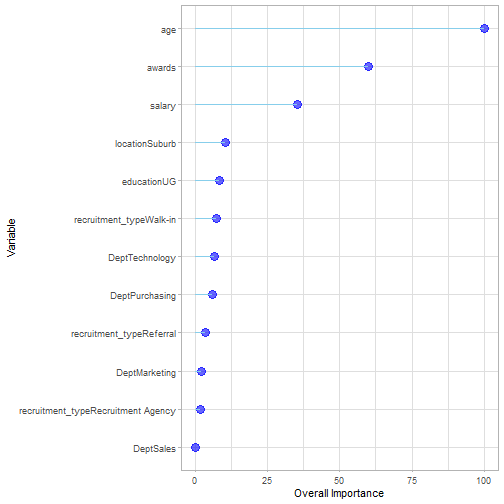

# Predicting Employee Satisfaction with a Gradient Boosting Model

## Description of Data

This is data from a survey of 500 employees on whether they are satisfied in their position or not that I retrieved from Kaggle. The data contains variables of age, department, location, education, how they were recruited, awards they have received, and salary. I am going to predict satisfaction using gradient boosting.


```r
psych::describe(EmpSatisfaction)
```

```
##                   vars   n     mean       sd  median
## emp_id*              1 500   249.83   144.10   249.5
## age                  2 500    38.61     9.44    39.0
## Dept*                3 500     2.96     1.42     3.0
## location*            4 500     1.48     0.50     1.0
## education*           5 500     1.49     0.50     1.0
## recruitment_type*    6 500     2.51     1.14     3.0
## awards               7 500     4.54     2.85     5.0
## salary               8 500 50416.06 23671.39 42419.0
## satisfied_binary     9 500     0.53     0.50     1.0
## satisfied*          10 500     1.53     0.50     2.0
##                    trimmed      mad   min   max range
## emp_id*             249.78   184.58     1   499   498
## age                  38.60    11.86    23    54    31
## Dept*                 2.95     1.48     1     5     4
## location*             1.48     0.00     1     2     1
## education*            1.49     0.00     1     2     1
## recruitment_type*     2.51     1.48     1     4     3
## awards                4.56     2.97     0     9     9
## salary            49166.82 27195.33 24076 86750 62674
## satisfied_binary      0.53     0.00     0     1     1
## satisfied*            1.53     0.00     1     2     1
##                    skew kurtosis      se
## emp_id*            0.00    -1.21    6.44
## age               -0.01    -1.24    0.42
## Dept*              0.03    -1.29    0.06
## location*          0.07    -2.00    0.02
## education*         0.03    -2.00    0.02
## recruitment_type* -0.04    -1.41    0.05
## awards            -0.02    -1.20    0.13
## salary             0.39    -1.40 1058.62
## satisfied_binary  -0.10    -1.99    0.02
## satisfied*        -0.10    -1.99    0.02
```

Here are the descriptive statistics of the data. There are 500 observation. The dataset seems to have reasonable values and no outliers.

## Gradient Boosting

Gradient Boosting is a machine learning model that quickly learns from weak spots in its previous fittings of the data. Boosting alone is the process of initially fitting a model to the dataset (like a decision tree), then creating a second model that identifies the weak learners from the first model and improves the accuracy of the weak predictions. This process is repeated many times to improve the model. Gradient boosting uses this technique to try and create the potentially best next model combined with the previous models to decrease the overall prediction error. The name gradient comes from target outcomes being used in each model based on the gradient of the error regarding the prediction, and every new model tries to minimize the prediction error.


## Let's try this on the Dataset

We are trying to predict employee satisfaction. We are going to grab the data and split the data 60/40. 


```r
set.seed(1)
library(tidyverse)
library(caret)
trainIndex <- createDataPartition(EmpSatisfaction$satisfied, p = .6, list = FALSE, times = 1)
```


```r
ESTrain <- EmpSatisfaction[ trainIndex,]
ESTest  <- EmpSatisfaction[-trainIndex,]
```

### The Model


```r
set.seed(1)

ESgbm<- train(
  form = satisfied ~ age+Dept+location+education+recruitment_type+awards+salary,
  data = ESTrain,
  trControl = trainControl(method = "cv", number=10),
  method = "gbm",
  tuneLength = 20,
  verbose=FALSE)

knitr::kable(ESgbm$bestTune)
```

<table>
 <thead>
  <tr>
   <th style="text-align:left;">   </th>
   <th style="text-align:right;"> n.trees </th>
   <th style="text-align:right;"> interaction.depth </th>
   <th style="text-align:right;"> shrinkage </th>
   <th style="text-align:right;"> n.minobsinnode </th>
  </tr>
 </thead>
<tbody>
  <tr>
   <td style="text-align:left;"> 73 </td>
   <td style="text-align:right;"> 650 </td>
   <td style="text-align:right;"> 4 </td>
   <td style="text-align:right;"> 0.1 </td>
   <td style="text-align:right;"> 10 </td>
  </tr>
</tbody>
</table>


```r
ESgbm_Pred<-predict(ESgbm,ESTest,type="prob")

knitr::kable(ESgbm_Pred)%>%
  kableExtra::kable_styling("striped")%>%
  kableExtra::scroll_box(width = "50%",height="300px")
```

<div style="border: 1px solid #ddd; padding: 0px; overflow-y: scroll; height:300px; overflow-x: scroll; width:50%; "><table class="table table-striped" style="margin-left: auto; margin-right: auto;">
 <thead>
  <tr>
   <th style="text-align:right;position: sticky; top:0; background-color: #FFFFFF;"> no </th>
   <th style="text-align:right;position: sticky; top:0; background-color: #FFFFFF;"> yes </th>
  </tr>
 </thead>
<tbody>
  <tr>
   <td style="text-align:right;"> 0.7618648 </td>
   <td style="text-align:right;"> 0.2381352 </td>
  </tr>
  <tr>
   <td style="text-align:right;"> 0.0785566 </td>
   <td style="text-align:right;"> 0.9214434 </td>
  </tr>
  <tr>
   <td style="text-align:right;"> 0.2823585 </td>
   <td style="text-align:right;"> 0.7176415 </td>
  </tr>
  <tr>
   <td style="text-align:right;"> 0.8432452 </td>
   <td style="text-align:right;"> 0.1567548 </td>
  </tr>
  <tr>
   <td style="text-align:right;"> 0.1231662 </td>
   <td style="text-align:right;"> 0.8768338 </td>
  </tr>
  <tr>
   <td style="text-align:right;"> 0.1499583 </td>
   <td style="text-align:right;"> 0.8500417 </td>
  </tr>
  <tr>
   <td style="text-align:right;"> 0.5785597 </td>
   <td style="text-align:right;"> 0.4214403 </td>
  </tr>
  <tr>
   <td style="text-align:right;"> 0.3866187 </td>
   <td style="text-align:right;"> 0.6133813 </td>
  </tr>
  <tr>
   <td style="text-align:right;"> 0.2615155 </td>
   <td style="text-align:right;"> 0.7384845 </td>
  </tr>
  <tr>
   <td style="text-align:right;"> 0.7289890 </td>
   <td style="text-align:right;"> 0.2710110 </td>
  </tr>
  <tr>
   <td style="text-align:right;"> 0.3277814 </td>
   <td style="text-align:right;"> 0.6722186 </td>
  </tr>
  <tr>
   <td style="text-align:right;"> 0.6853445 </td>
   <td style="text-align:right;"> 0.3146555 </td>
  </tr>
  <tr>
   <td style="text-align:right;"> 0.9268536 </td>
   <td style="text-align:right;"> 0.0731464 </td>
  </tr>
  <tr>
   <td style="text-align:right;"> 0.3133552 </td>
   <td style="text-align:right;"> 0.6866448 </td>
  </tr>
  <tr>
   <td style="text-align:right;"> 0.6768807 </td>
   <td style="text-align:right;"> 0.3231193 </td>
  </tr>
  <tr>
   <td style="text-align:right;"> 0.3767504 </td>
   <td style="text-align:right;"> 0.6232496 </td>
  </tr>
  <tr>
   <td style="text-align:right;"> 0.4255515 </td>
   <td style="text-align:right;"> 0.5744485 </td>
  </tr>
  <tr>
   <td style="text-align:right;"> 0.0883748 </td>
   <td style="text-align:right;"> 0.9116252 </td>
  </tr>
  <tr>
   <td style="text-align:right;"> 0.6688908 </td>
   <td style="text-align:right;"> 0.3311092 </td>
  </tr>
  <tr>
   <td style="text-align:right;"> 0.0768517 </td>
   <td style="text-align:right;"> 0.9231483 </td>
  </tr>
  <tr>
   <td style="text-align:right;"> 0.7788126 </td>
   <td style="text-align:right;"> 0.2211874 </td>
  </tr>
  <tr>
   <td style="text-align:right;"> 0.1170327 </td>
   <td style="text-align:right;"> 0.8829673 </td>
  </tr>
  <tr>
   <td style="text-align:right;"> 0.0269023 </td>
   <td style="text-align:right;"> 0.9730977 </td>
  </tr>
  <tr>
   <td style="text-align:right;"> 0.9633788 </td>
   <td style="text-align:right;"> 0.0366212 </td>
  </tr>
  <tr>
   <td style="text-align:right;"> 0.4401132 </td>
   <td style="text-align:right;"> 0.5598868 </td>
  </tr>
  <tr>
   <td style="text-align:right;"> 0.1032420 </td>
   <td style="text-align:right;"> 0.8967580 </td>
  </tr>
  <tr>
   <td style="text-align:right;"> 0.9832773 </td>
   <td style="text-align:right;"> 0.0167227 </td>
  </tr>
  <tr>
   <td style="text-align:right;"> 0.5886693 </td>
   <td style="text-align:right;"> 0.4113307 </td>
  </tr>
  <tr>
   <td style="text-align:right;"> 0.4187662 </td>
   <td style="text-align:right;"> 0.5812338 </td>
  </tr>
  <tr>
   <td style="text-align:right;"> 0.7889876 </td>
   <td style="text-align:right;"> 0.2110124 </td>
  </tr>
  <tr>
   <td style="text-align:right;"> 0.4366751 </td>
   <td style="text-align:right;"> 0.5633249 </td>
  </tr>
  <tr>
   <td style="text-align:right;"> 0.4177204 </td>
   <td style="text-align:right;"> 0.5822796 </td>
  </tr>
  <tr>
   <td style="text-align:right;"> 0.2919550 </td>
   <td style="text-align:right;"> 0.7080450 </td>
  </tr>
  <tr>
   <td style="text-align:right;"> 0.0287287 </td>
   <td style="text-align:right;"> 0.9712713 </td>
  </tr>
  <tr>
   <td style="text-align:right;"> 0.9278537 </td>
   <td style="text-align:right;"> 0.0721463 </td>
  </tr>
  <tr>
   <td style="text-align:right;"> 0.8934762 </td>
   <td style="text-align:right;"> 0.1065238 </td>
  </tr>
  <tr>
   <td style="text-align:right;"> 0.9120882 </td>
   <td style="text-align:right;"> 0.0879118 </td>
  </tr>
  <tr>
   <td style="text-align:right;"> 0.8550905 </td>
   <td style="text-align:right;"> 0.1449095 </td>
  </tr>
  <tr>
   <td style="text-align:right;"> 0.3238016 </td>
   <td style="text-align:right;"> 0.6761984 </td>
  </tr>
  <tr>
   <td style="text-align:right;"> 0.1226285 </td>
   <td style="text-align:right;"> 0.8773715 </td>
  </tr>
  <tr>
   <td style="text-align:right;"> 0.6892855 </td>
   <td style="text-align:right;"> 0.3107145 </td>
  </tr>
  <tr>
   <td style="text-align:right;"> 0.4988494 </td>
   <td style="text-align:right;"> 0.5011506 </td>
  </tr>
  <tr>
   <td style="text-align:right;"> 0.5481017 </td>
   <td style="text-align:right;"> 0.4518983 </td>
  </tr>
  <tr>
   <td style="text-align:right;"> 0.4345854 </td>
   <td style="text-align:right;"> 0.5654146 </td>
  </tr>
  <tr>
   <td style="text-align:right;"> 0.5539465 </td>
   <td style="text-align:right;"> 0.4460535 </td>
  </tr>
  <tr>
   <td style="text-align:right;"> 0.1580162 </td>
   <td style="text-align:right;"> 0.8419838 </td>
  </tr>
  <tr>
   <td style="text-align:right;"> 0.2131466 </td>
   <td style="text-align:right;"> 0.7868534 </td>
  </tr>
  <tr>
   <td style="text-align:right;"> 0.9134534 </td>
   <td style="text-align:right;"> 0.0865466 </td>
  </tr>
  <tr>
   <td style="text-align:right;"> 0.2455100 </td>
   <td style="text-align:right;"> 0.7544900 </td>
  </tr>
  <tr>
   <td style="text-align:right;"> 0.2625947 </td>
   <td style="text-align:right;"> 0.7374053 </td>
  </tr>
  <tr>
   <td style="text-align:right;"> 0.1534828 </td>
   <td style="text-align:right;"> 0.8465172 </td>
  </tr>
  <tr>
   <td style="text-align:right;"> 0.7504757 </td>
   <td style="text-align:right;"> 0.2495243 </td>
  </tr>
  <tr>
   <td style="text-align:right;"> 0.2760898 </td>
   <td style="text-align:right;"> 0.7239102 </td>
  </tr>
  <tr>
   <td style="text-align:right;"> 0.0858180 </td>
   <td style="text-align:right;"> 0.9141820 </td>
  </tr>
  <tr>
   <td style="text-align:right;"> 0.7204301 </td>
   <td style="text-align:right;"> 0.2795699 </td>
  </tr>
  <tr>
   <td style="text-align:right;"> 0.3131688 </td>
   <td style="text-align:right;"> 0.6868312 </td>
  </tr>
  <tr>
   <td style="text-align:right;"> 0.4880263 </td>
   <td style="text-align:right;"> 0.5119737 </td>
  </tr>
  <tr>
   <td style="text-align:right;"> 0.7964236 </td>
   <td style="text-align:right;"> 0.2035764 </td>
  </tr>
  <tr>
   <td style="text-align:right;"> 0.8313312 </td>
   <td style="text-align:right;"> 0.1686688 </td>
  </tr>
  <tr>
   <td style="text-align:right;"> 0.0369226 </td>
   <td style="text-align:right;"> 0.9630774 </td>
  </tr>
  <tr>
   <td style="text-align:right;"> 0.1377333 </td>
   <td style="text-align:right;"> 0.8622667 </td>
  </tr>
  <tr>
   <td style="text-align:right;"> 0.9711728 </td>
   <td style="text-align:right;"> 0.0288272 </td>
  </tr>
  <tr>
   <td style="text-align:right;"> 0.1941866 </td>
   <td style="text-align:right;"> 0.8058134 </td>
  </tr>
  <tr>
   <td style="text-align:right;"> 0.1830170 </td>
   <td style="text-align:right;"> 0.8169830 </td>
  </tr>
  <tr>
   <td style="text-align:right;"> 0.6954657 </td>
   <td style="text-align:right;"> 0.3045343 </td>
  </tr>
  <tr>
   <td style="text-align:right;"> 0.3920248 </td>
   <td style="text-align:right;"> 0.6079752 </td>
  </tr>
  <tr>
   <td style="text-align:right;"> 0.2281067 </td>
   <td style="text-align:right;"> 0.7718933 </td>
  </tr>
  <tr>
   <td style="text-align:right;"> 0.8061435 </td>
   <td style="text-align:right;"> 0.1938565 </td>
  </tr>
  <tr>
   <td style="text-align:right;"> 0.3208200 </td>
   <td style="text-align:right;"> 0.6791800 </td>
  </tr>
  <tr>
   <td style="text-align:right;"> 0.8968024 </td>
   <td style="text-align:right;"> 0.1031976 </td>
  </tr>
  <tr>
   <td style="text-align:right;"> 0.3911769 </td>
   <td style="text-align:right;"> 0.6088231 </td>
  </tr>
  <tr>
   <td style="text-align:right;"> 0.6694396 </td>
   <td style="text-align:right;"> 0.3305604 </td>
  </tr>
  <tr>
   <td style="text-align:right;"> 0.2885501 </td>
   <td style="text-align:right;"> 0.7114499 </td>
  </tr>
  <tr>
   <td style="text-align:right;"> 0.0122471 </td>
   <td style="text-align:right;"> 0.9877529 </td>
  </tr>
  <tr>
   <td style="text-align:right;"> 0.1163562 </td>
   <td style="text-align:right;"> 0.8836438 </td>
  </tr>
  <tr>
   <td style="text-align:right;"> 0.1799201 </td>
   <td style="text-align:right;"> 0.8200799 </td>
  </tr>
  <tr>
   <td style="text-align:right;"> 0.0701597 </td>
   <td style="text-align:right;"> 0.9298403 </td>
  </tr>
  <tr>
   <td style="text-align:right;"> 0.1561636 </td>
   <td style="text-align:right;"> 0.8438364 </td>
  </tr>
  <tr>
   <td style="text-align:right;"> 0.2148212 </td>
   <td style="text-align:right;"> 0.7851788 </td>
  </tr>
  <tr>
   <td style="text-align:right;"> 0.4522923 </td>
   <td style="text-align:right;"> 0.5477077 </td>
  </tr>
  <tr>
   <td style="text-align:right;"> 0.0461916 </td>
   <td style="text-align:right;"> 0.9538084 </td>
  </tr>
  <tr>
   <td style="text-align:right;"> 0.3205699 </td>
   <td style="text-align:right;"> 0.6794301 </td>
  </tr>
  <tr>
   <td style="text-align:right;"> 0.6707340 </td>
   <td style="text-align:right;"> 0.3292660 </td>
  </tr>
  <tr>
   <td style="text-align:right;"> 0.4573617 </td>
   <td style="text-align:right;"> 0.5426383 </td>
  </tr>
  <tr>
   <td style="text-align:right;"> 0.9932923 </td>
   <td style="text-align:right;"> 0.0067077 </td>
  </tr>
  <tr>
   <td style="text-align:right;"> 0.5070539 </td>
   <td style="text-align:right;"> 0.4929461 </td>
  </tr>
  <tr>
   <td style="text-align:right;"> 0.4897388 </td>
   <td style="text-align:right;"> 0.5102612 </td>
  </tr>
  <tr>
   <td style="text-align:right;"> 0.9504219 </td>
   <td style="text-align:right;"> 0.0495781 </td>
  </tr>
  <tr>
   <td style="text-align:right;"> 0.4114004 </td>
   <td style="text-align:right;"> 0.5885996 </td>
  </tr>
  <tr>
   <td style="text-align:right;"> 0.7495928 </td>
   <td style="text-align:right;"> 0.2504072 </td>
  </tr>
  <tr>
   <td style="text-align:right;"> 0.0527940 </td>
   <td style="text-align:right;"> 0.9472060 </td>
  </tr>
  <tr>
   <td style="text-align:right;"> 0.0378415 </td>
   <td style="text-align:right;"> 0.9621585 </td>
  </tr>
  <tr>
   <td style="text-align:right;"> 0.6144680 </td>
   <td style="text-align:right;"> 0.3855320 </td>
  </tr>
  <tr>
   <td style="text-align:right;"> 0.0174678 </td>
   <td style="text-align:right;"> 0.9825322 </td>
  </tr>
  <tr>
   <td style="text-align:right;"> 0.1063679 </td>
   <td style="text-align:right;"> 0.8936321 </td>
  </tr>
  <tr>
   <td style="text-align:right;"> 0.4462840 </td>
   <td style="text-align:right;"> 0.5537160 </td>
  </tr>
  <tr>
   <td style="text-align:right;"> 0.1640101 </td>
   <td style="text-align:right;"> 0.8359899 </td>
  </tr>
  <tr>
   <td style="text-align:right;"> 0.0780482 </td>
   <td style="text-align:right;"> 0.9219518 </td>
  </tr>
  <tr>
   <td style="text-align:right;"> 0.3094997 </td>
   <td style="text-align:right;"> 0.6905003 </td>
  </tr>
  <tr>
   <td style="text-align:right;"> 0.7832169 </td>
   <td style="text-align:right;"> 0.2167831 </td>
  </tr>
  <tr>
   <td style="text-align:right;"> 0.0652456 </td>
   <td style="text-align:right;"> 0.9347544 </td>
  </tr>
  <tr>
   <td style="text-align:right;"> 0.3360782 </td>
   <td style="text-align:right;"> 0.6639218 </td>
  </tr>
  <tr>
   <td style="text-align:right;"> 0.0779567 </td>
   <td style="text-align:right;"> 0.9220433 </td>
  </tr>
  <tr>
   <td style="text-align:right;"> 0.1551301 </td>
   <td style="text-align:right;"> 0.8448699 </td>
  </tr>
  <tr>
   <td style="text-align:right;"> 0.8983173 </td>
   <td style="text-align:right;"> 0.1016827 </td>
  </tr>
  <tr>
   <td style="text-align:right;"> 0.0899284 </td>
   <td style="text-align:right;"> 0.9100716 </td>
  </tr>
  <tr>
   <td style="text-align:right;"> 0.9076199 </td>
   <td style="text-align:right;"> 0.0923801 </td>
  </tr>
  <tr>
   <td style="text-align:right;"> 0.0714790 </td>
   <td style="text-align:right;"> 0.9285210 </td>
  </tr>
  <tr>
   <td style="text-align:right;"> 0.4002066 </td>
   <td style="text-align:right;"> 0.5997934 </td>
  </tr>
  <tr>
   <td style="text-align:right;"> 0.8224325 </td>
   <td style="text-align:right;"> 0.1775675 </td>
  </tr>
  <tr>
   <td style="text-align:right;"> 0.7509628 </td>
   <td style="text-align:right;"> 0.2490372 </td>
  </tr>
  <tr>
   <td style="text-align:right;"> 0.5781089 </td>
   <td style="text-align:right;"> 0.4218911 </td>
  </tr>
  <tr>
   <td style="text-align:right;"> 0.2261887 </td>
   <td style="text-align:right;"> 0.7738113 </td>
  </tr>
  <tr>
   <td style="text-align:right;"> 0.0308015 </td>
   <td style="text-align:right;"> 0.9691985 </td>
  </tr>
  <tr>
   <td style="text-align:right;"> 0.9423730 </td>
   <td style="text-align:right;"> 0.0576270 </td>
  </tr>
  <tr>
   <td style="text-align:right;"> 0.0598248 </td>
   <td style="text-align:right;"> 0.9401752 </td>
  </tr>
  <tr>
   <td style="text-align:right;"> 0.9106635 </td>
   <td style="text-align:right;"> 0.0893365 </td>
  </tr>
  <tr>
   <td style="text-align:right;"> 0.0443477 </td>
   <td style="text-align:right;"> 0.9556523 </td>
  </tr>
  <tr>
   <td style="text-align:right;"> 0.1040396 </td>
   <td style="text-align:right;"> 0.8959604 </td>
  </tr>
  <tr>
   <td style="text-align:right;"> 0.8495030 </td>
   <td style="text-align:right;"> 0.1504970 </td>
  </tr>
  <tr>
   <td style="text-align:right;"> 0.8019482 </td>
   <td style="text-align:right;"> 0.1980518 </td>
  </tr>
  <tr>
   <td style="text-align:right;"> 0.2352023 </td>
   <td style="text-align:right;"> 0.7647977 </td>
  </tr>
  <tr>
   <td style="text-align:right;"> 0.1877429 </td>
   <td style="text-align:right;"> 0.8122571 </td>
  </tr>
  <tr>
   <td style="text-align:right;"> 0.3620472 </td>
   <td style="text-align:right;"> 0.6379528 </td>
  </tr>
  <tr>
   <td style="text-align:right;"> 0.0589836 </td>
   <td style="text-align:right;"> 0.9410164 </td>
  </tr>
  <tr>
   <td style="text-align:right;"> 0.3445870 </td>
   <td style="text-align:right;"> 0.6554130 </td>
  </tr>
  <tr>
   <td style="text-align:right;"> 0.6040296 </td>
   <td style="text-align:right;"> 0.3959704 </td>
  </tr>
  <tr>
   <td style="text-align:right;"> 0.7918178 </td>
   <td style="text-align:right;"> 0.2081822 </td>
  </tr>
  <tr>
   <td style="text-align:right;"> 0.9649594 </td>
   <td style="text-align:right;"> 0.0350406 </td>
  </tr>
  <tr>
   <td style="text-align:right;"> 0.0712240 </td>
   <td style="text-align:right;"> 0.9287760 </td>
  </tr>
  <tr>
   <td style="text-align:right;"> 0.0595781 </td>
   <td style="text-align:right;"> 0.9404219 </td>
  </tr>
  <tr>
   <td style="text-align:right;"> 0.9118608 </td>
   <td style="text-align:right;"> 0.0881392 </td>
  </tr>
  <tr>
   <td style="text-align:right;"> 0.0793940 </td>
   <td style="text-align:right;"> 0.9206060 </td>
  </tr>
  <tr>
   <td style="text-align:right;"> 0.8202398 </td>
   <td style="text-align:right;"> 0.1797602 </td>
  </tr>
  <tr>
   <td style="text-align:right;"> 0.1930464 </td>
   <td style="text-align:right;"> 0.8069536 </td>
  </tr>
  <tr>
   <td style="text-align:right;"> 0.6795295 </td>
   <td style="text-align:right;"> 0.3204705 </td>
  </tr>
  <tr>
   <td style="text-align:right;"> 0.3233729 </td>
   <td style="text-align:right;"> 0.6766271 </td>
  </tr>
  <tr>
   <td style="text-align:right;"> 0.9246017 </td>
   <td style="text-align:right;"> 0.0753983 </td>
  </tr>
  <tr>
   <td style="text-align:right;"> 0.7193954 </td>
   <td style="text-align:right;"> 0.2806046 </td>
  </tr>
  <tr>
   <td style="text-align:right;"> 0.0599086 </td>
   <td style="text-align:right;"> 0.9400914 </td>
  </tr>
  <tr>
   <td style="text-align:right;"> 0.1394551 </td>
   <td style="text-align:right;"> 0.8605449 </td>
  </tr>
  <tr>
   <td style="text-align:right;"> 0.4093249 </td>
   <td style="text-align:right;"> 0.5906751 </td>
  </tr>
  <tr>
   <td style="text-align:right;"> 0.2415742 </td>
   <td style="text-align:right;"> 0.7584258 </td>
  </tr>
  <tr>
   <td style="text-align:right;"> 0.3704875 </td>
   <td style="text-align:right;"> 0.6295125 </td>
  </tr>
  <tr>
   <td style="text-align:right;"> 0.6188203 </td>
   <td style="text-align:right;"> 0.3811797 </td>
  </tr>
  <tr>
   <td style="text-align:right;"> 0.9028347 </td>
   <td style="text-align:right;"> 0.0971653 </td>
  </tr>
  <tr>
   <td style="text-align:right;"> 0.3450860 </td>
   <td style="text-align:right;"> 0.6549140 </td>
  </tr>
  <tr>
   <td style="text-align:right;"> 0.1100873 </td>
   <td style="text-align:right;"> 0.8899127 </td>
  </tr>
  <tr>
   <td style="text-align:right;"> 0.3598674 </td>
   <td style="text-align:right;"> 0.6401326 </td>
  </tr>
  <tr>
   <td style="text-align:right;"> 0.3830889 </td>
   <td style="text-align:right;"> 0.6169111 </td>
  </tr>
  <tr>
   <td style="text-align:right;"> 0.3662811 </td>
   <td style="text-align:right;"> 0.6337189 </td>
  </tr>
  <tr>
   <td style="text-align:right;"> 0.0763589 </td>
   <td style="text-align:right;"> 0.9236411 </td>
  </tr>
  <tr>
   <td style="text-align:right;"> 0.0622508 </td>
   <td style="text-align:right;"> 0.9377492 </td>
  </tr>
  <tr>
   <td style="text-align:right;"> 0.9941658 </td>
   <td style="text-align:right;"> 0.0058342 </td>
  </tr>
  <tr>
   <td style="text-align:right;"> 0.6874389 </td>
   <td style="text-align:right;"> 0.3125611 </td>
  </tr>
  <tr>
   <td style="text-align:right;"> 0.7078281 </td>
   <td style="text-align:right;"> 0.2921719 </td>
  </tr>
  <tr>
   <td style="text-align:right;"> 0.4038449 </td>
   <td style="text-align:right;"> 0.5961551 </td>
  </tr>
  <tr>
   <td style="text-align:right;"> 0.6459056 </td>
   <td style="text-align:right;"> 0.3540944 </td>
  </tr>
  <tr>
   <td style="text-align:right;"> 0.5863081 </td>
   <td style="text-align:right;"> 0.4136919 </td>
  </tr>
  <tr>
   <td style="text-align:right;"> 0.4600120 </td>
   <td style="text-align:right;"> 0.5399880 </td>
  </tr>
  <tr>
   <td style="text-align:right;"> 0.1242204 </td>
   <td style="text-align:right;"> 0.8757796 </td>
  </tr>
  <tr>
   <td style="text-align:right;"> 0.0208783 </td>
   <td style="text-align:right;"> 0.9791217 </td>
  </tr>
  <tr>
   <td style="text-align:right;"> 0.6561747 </td>
   <td style="text-align:right;"> 0.3438253 </td>
  </tr>
  <tr>
   <td style="text-align:right;"> 0.8347069 </td>
   <td style="text-align:right;"> 0.1652931 </td>
  </tr>
  <tr>
   <td style="text-align:right;"> 0.9895497 </td>
   <td style="text-align:right;"> 0.0104503 </td>
  </tr>
  <tr>
   <td style="text-align:right;"> 0.5568241 </td>
   <td style="text-align:right;"> 0.4431759 </td>
  </tr>
  <tr>
   <td style="text-align:right;"> 0.6091990 </td>
   <td style="text-align:right;"> 0.3908010 </td>
  </tr>
  <tr>
   <td style="text-align:right;"> 0.5420164 </td>
   <td style="text-align:right;"> 0.4579836 </td>
  </tr>
  <tr>
   <td style="text-align:right;"> 0.2412880 </td>
   <td style="text-align:right;"> 0.7587120 </td>
  </tr>
  <tr>
   <td style="text-align:right;"> 0.5341223 </td>
   <td style="text-align:right;"> 0.4658777 </td>
  </tr>
  <tr>
   <td style="text-align:right;"> 0.3806185 </td>
   <td style="text-align:right;"> 0.6193815 </td>
  </tr>
  <tr>
   <td style="text-align:right;"> 0.3479584 </td>
   <td style="text-align:right;"> 0.6520416 </td>
  </tr>
  <tr>
   <td style="text-align:right;"> 0.3409105 </td>
   <td style="text-align:right;"> 0.6590895 </td>
  </tr>
  <tr>
   <td style="text-align:right;"> 0.3556207 </td>
   <td style="text-align:right;"> 0.6443793 </td>
  </tr>
  <tr>
   <td style="text-align:right;"> 0.9274747 </td>
   <td style="text-align:right;"> 0.0725253 </td>
  </tr>
  <tr>
   <td style="text-align:right;"> 0.8663464 </td>
   <td style="text-align:right;"> 0.1336536 </td>
  </tr>
  <tr>
   <td style="text-align:right;"> 0.5438781 </td>
   <td style="text-align:right;"> 0.4561219 </td>
  </tr>
  <tr>
   <td style="text-align:right;"> 0.0548059 </td>
   <td style="text-align:right;"> 0.9451941 </td>
  </tr>
  <tr>
   <td style="text-align:right;"> 0.1291573 </td>
   <td style="text-align:right;"> 0.8708427 </td>
  </tr>
  <tr>
   <td style="text-align:right;"> 0.1352148 </td>
   <td style="text-align:right;"> 0.8647852 </td>
  </tr>
  <tr>
   <td style="text-align:right;"> 0.5188760 </td>
   <td style="text-align:right;"> 0.4811240 </td>
  </tr>
  <tr>
   <td style="text-align:right;"> 0.5090612 </td>
   <td style="text-align:right;"> 0.4909388 </td>
  </tr>
  <tr>
   <td style="text-align:right;"> 0.2443755 </td>
   <td style="text-align:right;"> 0.7556245 </td>
  </tr>
  <tr>
   <td style="text-align:right;"> 0.1207694 </td>
   <td style="text-align:right;"> 0.8792306 </td>
  </tr>
  <tr>
   <td style="text-align:right;"> 0.0558546 </td>
   <td style="text-align:right;"> 0.9441454 </td>
  </tr>
  <tr>
   <td style="text-align:right;"> 0.9552084 </td>
   <td style="text-align:right;"> 0.0447916 </td>
  </tr>
  <tr>
   <td style="text-align:right;"> 0.2865731 </td>
   <td style="text-align:right;"> 0.7134269 </td>
  </tr>
  <tr>
   <td style="text-align:right;"> 0.1525540 </td>
   <td style="text-align:right;"> 0.8474460 </td>
  </tr>
  <tr>
   <td style="text-align:right;"> 0.5615094 </td>
   <td style="text-align:right;"> 0.4384906 </td>
  </tr>
  <tr>
   <td style="text-align:right;"> 0.0603066 </td>
   <td style="text-align:right;"> 0.9396934 </td>
  </tr>
  <tr>
   <td style="text-align:right;"> 0.3405357 </td>
   <td style="text-align:right;"> 0.6594643 </td>
  </tr>
  <tr>
   <td style="text-align:right;"> 0.4680873 </td>
   <td style="text-align:right;"> 0.5319127 </td>
  </tr>
  <tr>
   <td style="text-align:right;"> 0.9116347 </td>
   <td style="text-align:right;"> 0.0883653 </td>
  </tr>
  <tr>
   <td style="text-align:right;"> 0.9108136 </td>
   <td style="text-align:right;"> 0.0891864 </td>
  </tr>
  <tr>
   <td style="text-align:right;"> 0.2936801 </td>
   <td style="text-align:right;"> 0.7063199 </td>
  </tr>
  <tr>
   <td style="text-align:right;"> 0.4909962 </td>
   <td style="text-align:right;"> 0.5090038 </td>
  </tr>
  <tr>
   <td style="text-align:right;"> 0.0369937 </td>
   <td style="text-align:right;"> 0.9630063 </td>
  </tr>
  <tr>
   <td style="text-align:right;"> 0.0559069 </td>
   <td style="text-align:right;"> 0.9440931 </td>
  </tr>
  <tr>
   <td style="text-align:right;"> 0.9858944 </td>
   <td style="text-align:right;"> 0.0141056 </td>
  </tr>
</tbody>
</table></div>


```r
ESgbmtestpred<-cbind(ESgbm_Pred,ESTest)

ESgbmtestpred<-ESgbmtestpred%>%
  mutate(prediction=if_else(yes>no,"yes",
                            if_else(no>yes, "no", "PROBLEM")))

table(ESgbmtestpred$prediction)
```

```
## 
##  no yes 
##  78 121
```


```r
ESgbmConfusion<-confusionMatrix(factor(ESgbmtestpred$prediction),factor(ESgbmtestpred$satisfied))

ESgbmConfusion
```

```
## Confusion Matrix and Statistics
## 
##           Reference
## Prediction no yes
##        no  42  36
##        yes 52  69
##                                          
##                Accuracy : 0.5578         
##                  95% CI : (0.4859, 0.628)
##     No Information Rate : 0.5276         
##     P-Value [Acc > NIR] : 0.2176         
##                                          
##                   Kappa : 0.1049         
##                                          
##  Mcnemar's Test P-Value : 0.1098         
##                                          
##             Sensitivity : 0.4468         
##             Specificity : 0.6571         
##          Pos Pred Value : 0.5385         
##          Neg Pred Value : 0.5702         
##              Prevalence : 0.4724         
##          Detection Rate : 0.2111         
##    Detection Prevalence : 0.3920         
##       Balanced Accuracy : 0.5520         
##                                          
##        'Positive' Class : no             
## 
```

We can see here the accuracy of our model was only about 55%.


```r
library(gbm)
V<-caret::varImp(ESgbm, n.trees=500)$importance%>%
  arrange(desc(Overall))

knitr::kable(V)%>%
  kableExtra::kable_styling("striped")%>%
  kableExtra::scroll_box(width = "50%",height="300px")
```

<div style="border: 1px solid #ddd; padding: 0px; overflow-y: scroll; height:300px; overflow-x: scroll; width:50%; "><table class="table table-striped" style="margin-left: auto; margin-right: auto;">
 <thead>
  <tr>
   <th style="text-align:left;position: sticky; top:0; background-color: #FFFFFF;">   </th>
   <th style="text-align:right;position: sticky; top:0; background-color: #FFFFFF;"> Overall </th>
  </tr>
 </thead>
<tbody>
  <tr>
   <td style="text-align:left;"> age </td>
   <td style="text-align:right;"> 100.000000 </td>
  </tr>
  <tr>
   <td style="text-align:left;"> awards </td>
   <td style="text-align:right;"> 60.033121 </td>
  </tr>
  <tr>
   <td style="text-align:left;"> salary </td>
   <td style="text-align:right;"> 35.363464 </td>
  </tr>
  <tr>
   <td style="text-align:left;"> locationSuburb </td>
   <td style="text-align:right;"> 10.405331 </td>
  </tr>
  <tr>
   <td style="text-align:left;"> educationUG </td>
   <td style="text-align:right;"> 8.099968 </td>
  </tr>
  <tr>
   <td style="text-align:left;"> recruitment_typeWalk-in </td>
   <td style="text-align:right;"> 7.053523 </td>
  </tr>
  <tr>
   <td style="text-align:left;"> DeptTechnology </td>
   <td style="text-align:right;"> 6.643196 </td>
  </tr>
  <tr>
   <td style="text-align:left;"> DeptPurchasing </td>
   <td style="text-align:right;"> 5.779992 </td>
  </tr>
  <tr>
   <td style="text-align:left;"> recruitment_typeReferral </td>
   <td style="text-align:right;"> 3.250836 </td>
  </tr>
  <tr>
   <td style="text-align:left;"> DeptMarketing </td>
   <td style="text-align:right;"> 2.136217 </td>
  </tr>
  <tr>
   <td style="text-align:left;"> recruitment_typeRecruitment Agency </td>
   <td style="text-align:right;"> 1.587838 </td>
  </tr>
  <tr>
   <td style="text-align:left;"> DeptSales </td>
   <td style="text-align:right;"> 0.000000 </td>
  </tr>
</tbody>
</table></div>


```r
ggplot2::ggplot(V, aes(x=reorder(rownames(V),Overall), y=Overall)) +
geom_point( color="blue", size=4, alpha=0.6)+
geom_segment( aes(x=rownames(V), xend=rownames(V), y=0, yend=Overall), 
color='skyblue') +
xlab('Variable')+
ylab('Overall Importance')+
theme_light() +
coord_flip() 
```




This table and graph show which variables have the most impact on employee satisfaction in our model. Age is shown as having the highest impact, and in being in the sales department is shown as having the lowest impact.

While this model does not perform the best, machine learning could be useful in assessing employee satisfaction. Another model could be used to better evaluate what variables contribute to greater satisfaction among employees. This can be useful to firms who want to boost their employees' satisfaction with the organization in order to retain talent and foster a positive environment for employees.


Further reading on Gradient Boosting:
https://www.displayr.com/gradient-boosting-the-coolest-kid-on-the-machine-learning-block/

